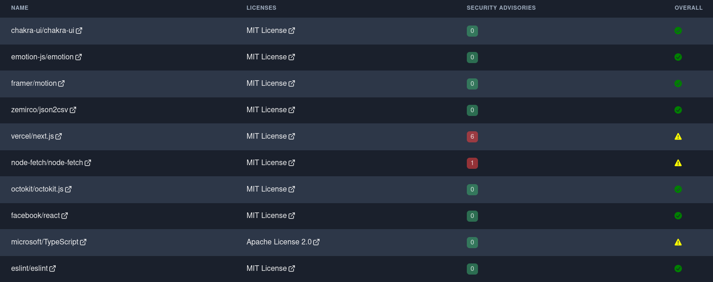

# OSS Facts

🔎 A dashboard to determine if Open Source Software (OSS) is friendly to use.

Visit [oss-facts](https://oss-facts.vercel.app/) to determine if certain Open Source Software (OSS) is friendly to use.

## Why?

When building a library, an application, or a framework, there is a good chance you will be depending on Open Source
Software (OSS). But not all OSS is friendly to use. The licensing of the OSS needs to be evaluated to determine if it is
friendly to what you are building. Before use OSS, you also need to determine if there are any open security advisories.

To help determine if OSS is friendly to use, this dashboard will help with providing this information in an
easy-to-understand way.

## What is determined friendly?

### Licensing

*OSS Facts* approaches the licensing in an **opinionated** way (not everyone will agree).

Any license that is "viral" (e.g. GNU, Mozilla 2.0) or forces source code to be disclosed is considered "not friendly"
to use. The reasoning is that not everyone building software will want to disclose their source code nor be forced to
use a certain license.

*OSS Facts* will simply make you aware of the risks of using OSS that has a "not friendly" license.

### Security

Any OSS that has any Security Advisories is not considered friendly to use. You need to check the OSS page to determine
if the vulnerability are acceptable to you.

## How to share OSS choices?

The dashboard has a nifty button that will download the OSS that you have added to a CSV file. This will help make is
easier to share what software you want to use. If you operate in a process heavy environment, this file will be helpful
with any requests or process you need to go thru.

See [oss-facts oss.csv](./oss.csv) for an example of the CSV file.

## Dashboard Example

Below is a screenshot of all the OSS that this application uses.

